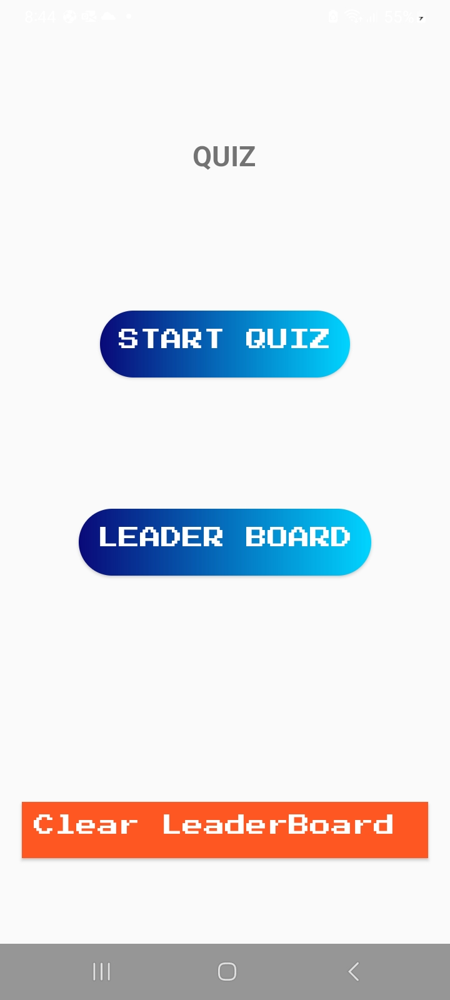
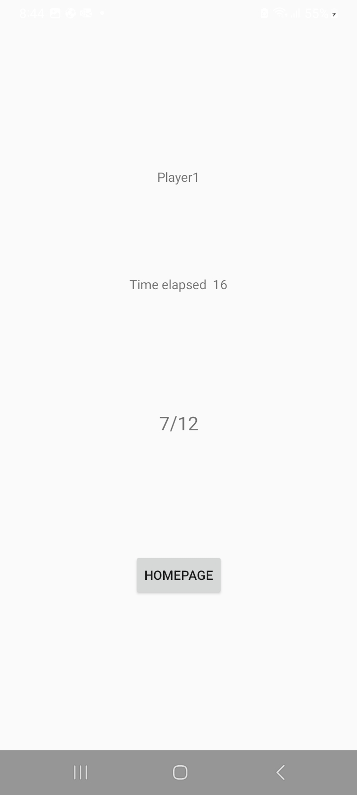
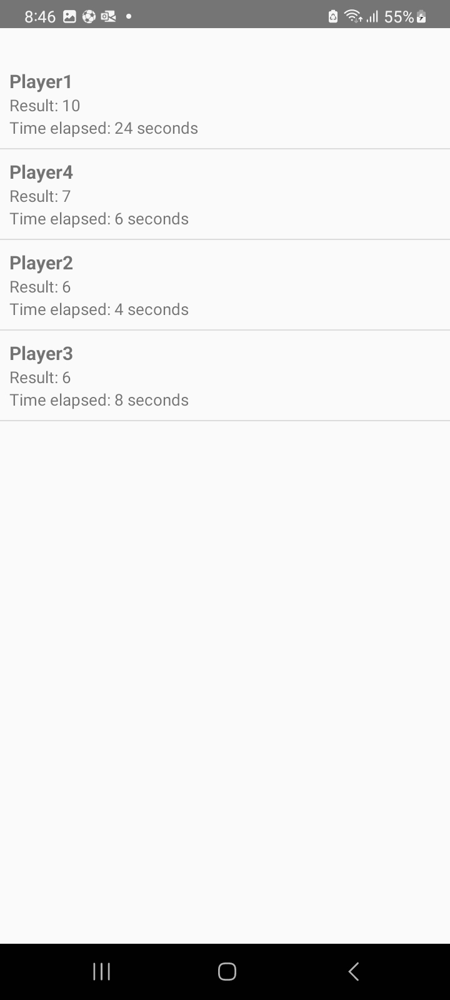

# Android Quiz Game

Welcome to the Android Quiz Game! This application is a fun and interactive quiz game that includes a main gameplay area and a leaderboard to track high scores. The app is written in Java and uses SQLite to manage the leaderboard.

## Features

- **Main Quiz Game**: Challenge yourself with a variety of questions.
- **Leaderboard**: View the top scores and compete to be the best.
- **Reset Leaderboard**: Clear all entries from the leaderboard.

## Screenshots

## SQLite Database

The app uses an SQLite database to manage the leaderboard. Here are the main database operations:

- **Insert Score**: Add a new score to the leaderboard.
- **Retrieve Scores**: Fetch all scores from the leaderboard.
- **Delete Scores**: Clear all entries in the leaderboard.

## Technologies Used

- **Java**: The main programming language used for the application.
- **Android Studio**: The integrated development environment (IDE) for Android development.
- **SQLite**: The database management system used to handle the leaderboard.
- **XML**: Used for designing the layout and user interface of the app.

## Code Overview

### LeaderboardActivity.java

Manages the leaderboard screen, displaying high scores from the SQLite database using a `SimpleCursorAdapter`.

### MainActivity.java

Handles the main menu, providing buttons to start the quiz, view the leaderboard, and clear the leaderboard.

### MyDBHelper.java

Manages the SQLite database, including creating the leaderboard table, inserting results, retrieving results, and clearing the leaderboard.

### QuizActivity.java

Manages the quiz gameplay, displaying questions and tracking the player's progress and time.

### QuizQuestion.java

Represents a single quiz question, including the question text, options, and the correct answer.

### QuizQuestions.java

Provides a set of predefined quiz questions.

### ResultActivity.java

Displays the quiz results and allows the player to save their score to the leaderboard.

n.

## Contact

E-mail - [mirko.terzic2002@gmail.com](mailto:your.email@example.com)

Linkedin -[My linkedin](https://www.linkedin.com/in/mirkoterzic/)

